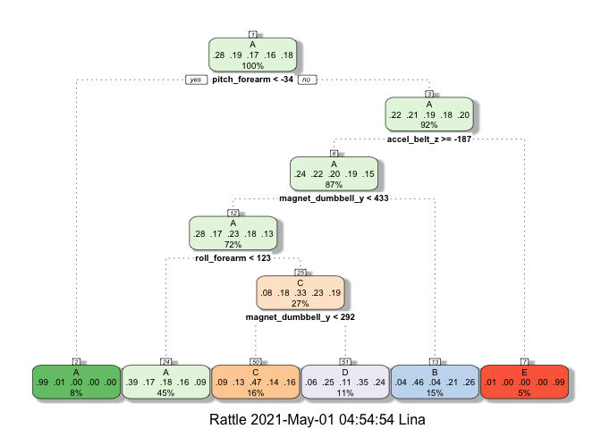
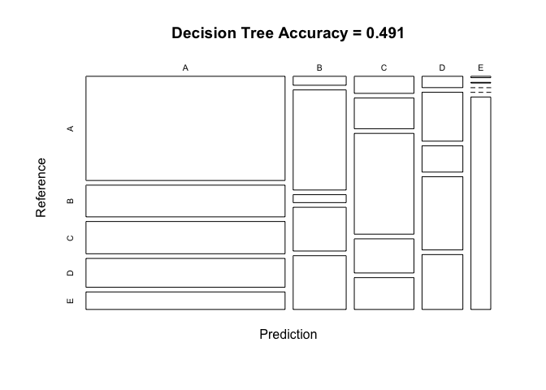
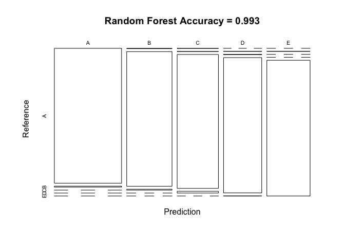
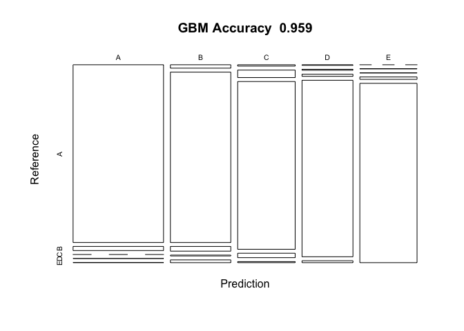

# Executive Summary

Using various devices it is now possible to collect a large amount of data about personal activity relatively inexpensively. People regularly quantify how much of a particular activity they do, but they rarely quantify how well they do it. In this project, we are going to use data from accelerometers on the belt, forearm, arm, and dumbell of 6 participants that performed barbell lifts correctly and incorrectly in 5 different ways:
- exactly according to the specification (Class A)
- throwing the elbows to the front (Class B)
- lifting the dumbbell only halfway (Class C)
- lowering the dumbbell only halfway (Class D)
- throwing the hips to the front (Class E)
The goal of this project is to predict the manner in which they did the exercise.

This report describes how the model has been built, usage of the cross validation, what the expected out of sample error is, and which model performed the best. The best performing model is then used to predict 20 different test cases.

# Data Source

The data for this project came from [this source](http://web.archive.org/web/20161224072740/http:/groupware.les.inf.puc-rio.br/har).
The training data set is available [here](https://d396qusza40orc.cloudfront.net/predmachlearn/pml-training.csv) and the test data set could be found [here](https://d396qusza40orc.cloudfront.net/predmachlearn/pml-testing.csv).

# Preparing for Modelling

## Step 1: Loading the data and libraries


We are going to load some libraries needed for analysis and modeling.


Next, we download the data using urls provided and set the seed for reproducibility.


```r
# URLs for downloading the data files
training.url <- "http://d396qusza40orc.cloudfront.net/predmachlearn/pml-training.csv"
testing.url  <- "http://d396qusza40orc.cloudfront.net/predmachlearn/pml-testing.csv"

# download the datasets
training <- read.csv(url(training.url))
testing  <- read.csv(url(testing.url))

# Set seed for reproducibility
set.seed(1357)
```

## Step 2: Data Cleaning

Let's look at the dimensions of both data sets and variables.
Dimensions of the training data set are 19622, 160 and dimensions of the testing data set are 20, 160.

In order to reduce the data set to avoid over-fitting, we are are going to remove variables with almost no variance.


```r
# remove variables with Nearly Zero Variance
nzv <- nearZeroVar(training)
training.subset <- training[, -nzv]
dim(training.subset)
```

```
## [1] 19622   100
```

Next, we are going to remove variables that are mostly NAs (more than 95%) as they are not useful for modeling and may easily lead to over-fitting.


```r
# remove variables that are mostly NA
mostlyNA <- sapply(training.subset, function(x) mean(is.na(x))) > 0.95
training.subset <- training.subset[, mostlyNA==FALSE]
dim(training.subset)
```

```
## [1] 19622    59
```

We are now going to remove non-numeric variables as they are timestamps or used for identification purposes.


```r
# remove non-numeric only variables (columns 1 to 5)
training.subset <- training.subset[, -(1:7)]
dim(training.subset)
```

```
## [1] 19622    52
```

We are left with 54 variables.

## Step 3: Data Partioning, cross validation and out-of-sample error

We are going to split training data set to training and testing data subsets for cross-validation. We are going to split data using 70% and 30% proportions, respectively. We will train the model with 5-folds cross-validation to estimate an out-of-sample error. The expected value of the out-of-sample error shows the ratio of expected number of misclassified observations and total observations in the test data set.


```r
# partition the training data set 
TrainList  <- createDataPartition(training.subset$classe, p=0.7, list=FALSE)
train.subset <- training.subset[TrainList, ]
test.subset  <- training.subset[-TrainList, ]
dim(train.subset)
```

```
## [1] 13737    52
```

```r
dim(test.subset)
```

```
## [1] 5885   52
```

# Modelling

## Model 1: Decision Tree

The first model we are going to use is the decision tree using 5-folds cross-validation.

### Model


```r
controlDT <- trainControl(method="cv", number=5, verboseIter=FALSE)
DTmodel<- train(classe ~. , data=train.subset, method= "rpart", trControl=controlDT)
fancyRpartPlot(DTmodel$finalModel)
```

<!-- -->

### Prediction


```r
DTprediction<- predict(DTmodel, test.subset)
CMDT <- confusionMatrix(DTprediction, as.factor(test.subset$classe))
CMDT
```

```
## Confusion Matrix and Statistics
## 
##           Reference
## Prediction    A    B    C    D    E
##          A 1528  465  473  423  257
##          B   35  391   31  171  210
##          C   75  135  443  150  140
##          D   34  147   79  220  165
##          E    2    1    0    0  310
## 
## Overall Statistics
##                                           
##                Accuracy : 0.4914          
##                  95% CI : (0.4786, 0.5043)
##     No Information Rate : 0.2845          
##     P-Value [Acc > NIR] : < 2.2e-16       
##                                           
##                   Kappa : 0.3349          
##                                           
##  Mcnemar's Test P-Value : < 2.2e-16       
## 
## Statistics by Class:
## 
##                      Class: A Class: B Class: C Class: D Class: E
## Sensitivity            0.9128  0.34328  0.43177  0.22822  0.28651
## Specificity            0.6158  0.90582  0.89710  0.91364  0.99938
## Pos Pred Value         0.4857  0.46659  0.46978  0.34109  0.99042
## Neg Pred Value         0.9467  0.85179  0.88203  0.85802  0.86145
## Prevalence             0.2845  0.19354  0.17434  0.16381  0.18386
## Detection Rate         0.2596  0.06644  0.07528  0.03738  0.05268
## Detection Prevalence   0.5346  0.14240  0.16024  0.10960  0.05319
## Balanced Accuracy      0.7643  0.62455  0.66444  0.57093  0.64294
```


```r
plot(CMDT$table, col = CMDT$byClass, 
     main = paste("Decision Tree Accuracy =",
                  round(CMDT$overall['Accuracy'], 3)))
```

<!-- -->
From the Decision Tree Model we see the prediction accuracy is only 49%, so we need to look for a better model.

## Model 2: Random Forest

Next, we are going to try using Random Forest.

### Model


```r
controlRF <- trainControl(method="cv", number=5, verboseIter=FALSE)
RFmodel <- train(classe ~ ., data=train.subset, method="rf",
                          trControl=controlRF)
RFmodel$finalModel
```

```
## 
## Call:
##  randomForest(x = x, y = y, mtry = param$mtry) 
##                Type of random forest: classification
##                      Number of trees: 500
## No. of variables tried at each split: 26
## 
##         OOB estimate of  error rate: 0.72%
## Confusion matrix:
##      A    B    C    D    E class.error
## A 3898    5    0    1    2 0.002048131
## B   21 2631    5    0    1 0.010158014
## C    0   13 2373   10    0 0.009599332
## D    0    0   26 2222    4 0.013321492
## E    0    1    3    7 2514 0.004356436
```

### Prediction


```r
RFprediction <- predict(RFmodel, test.subset)
CMRF <- confusionMatrix(RFprediction, as.factor(test.subset$classe))
CMRF
```

```
## Confusion Matrix and Statistics
## 
##           Reference
## Prediction    A    B    C    D    E
##          A 1670   12    0    0    0
##          B    3 1124    7    0    0
##          C    1    1 1017   13    0
##          D    0    1    2  951    1
##          E    0    1    0    0 1081
## 
## Overall Statistics
##                                           
##                Accuracy : 0.9929          
##                  95% CI : (0.9904, 0.9949)
##     No Information Rate : 0.2845          
##     P-Value [Acc > NIR] : < 2.2e-16       
##                                           
##                   Kappa : 0.991           
##                                           
##  Mcnemar's Test P-Value : NA              
## 
## Statistics by Class:
## 
##                      Class: A Class: B Class: C Class: D Class: E
## Sensitivity            0.9976   0.9868   0.9912   0.9865   0.9991
## Specificity            0.9972   0.9979   0.9969   0.9992   0.9998
## Pos Pred Value         0.9929   0.9912   0.9855   0.9958   0.9991
## Neg Pred Value         0.9990   0.9968   0.9981   0.9974   0.9998
## Prevalence             0.2845   0.1935   0.1743   0.1638   0.1839
## Detection Rate         0.2838   0.1910   0.1728   0.1616   0.1837
## Detection Prevalence   0.2858   0.1927   0.1754   0.1623   0.1839
## Balanced Accuracy      0.9974   0.9924   0.9941   0.9929   0.9994
```


```r
plot(CMRF$table, col = CMRF$byClass, 
     main = paste("Random Forest Accuracy =",
                  round(CMRF$overall['Accuracy'], 3)))
```

<!-- -->
From the Random Forest Model we see the prediction accuracy is over 99%. This is a great result, but we will test the third model for comparison.

## Model 3: Gradient Boosting Model and Prediction

Lastly, we are going to try using GBM.

### Model


```r
controlGBM <- trainControl(method="cv", number=5, verboseIter=FALSE)
GBMmodel  <- train(classe ~ ., data=train.subset, method = "gbm",
                    trControl = controlGBM, verbose = FALSE)
GBMmodel$finalModel
```

```
## A gradient boosted model with multinomial loss function.
## 150 iterations were performed.
## There were 51 predictors of which 51 had non-zero influence.
```

### Prediction


```r
GBMprediction <- predict(GBMmodel, newdata=test.subset)
CMGBM <- confusionMatrix(GBMprediction, as.factor(test.subset$classe))
CMGBM
```

```
## Confusion Matrix and Statistics
## 
##           Reference
## Prediction    A    B    C    D    E
##          A 1642   38    0    1    1
##          B   21 1051   29    5   17
##          C    8   44  985   26    6
##          D    3    5   11  918   10
##          E    0    1    1   14 1048
## 
## Overall Statistics
##                                          
##                Accuracy : 0.959          
##                  95% CI : (0.9537, 0.964)
##     No Information Rate : 0.2845         
##     P-Value [Acc > NIR] : < 2.2e-16      
##                                          
##                   Kappa : 0.9482         
##                                          
##  Mcnemar's Test P-Value : 6.053e-06      
## 
## Statistics by Class:
## 
##                      Class: A Class: B Class: C Class: D Class: E
## Sensitivity            0.9809   0.9227   0.9600   0.9523   0.9686
## Specificity            0.9905   0.9848   0.9827   0.9941   0.9967
## Pos Pred Value         0.9762   0.9359   0.9214   0.9694   0.9850
## Neg Pred Value         0.9924   0.9815   0.9915   0.9907   0.9929
## Prevalence             0.2845   0.1935   0.1743   0.1638   0.1839
## Detection Rate         0.2790   0.1786   0.1674   0.1560   0.1781
## Detection Prevalence   0.2858   0.1908   0.1816   0.1609   0.1808
## Balanced Accuracy      0.9857   0.9538   0.9714   0.9732   0.9826
```
From the Gradient Boosting Model we see the prediction accuracy is 96% which is satisfied.


```r
plot(CMGBM$table, col = CMGBM$byClass, 
     main = paste("GBM Accuracy ", round(CMGBM$overall['Accuracy'], 3)))
```

<!-- -->

# Conclusions

## Result

The confusion matrices show that the Random Forest algorithm with 0.993 accuracy performs better then Decision Tree model (0.491 accuracy) or GBM (0.959 accuracy), so we are going to choose Random Forest algorithm as the final one. 

### Expected out-of-sample error

The expected out-of-sample error is estimated at 0.007, or 0.7%. It is calculated as 1 - accuracy for predictions made against the cross-validation set. 

With such a high accuracy and 20 data points in the test data set, we expect all or almost all predictions to be correct.

# Submission

We are going to use Random Forest algorithm to predict answers to the quiz.


```r
test_predict <- predict(RFmodel, testing)
test_predict
```

```
##  [1] B A B A A E D B A A B C B A E E A B B B
## Levels: A B C D E
```
